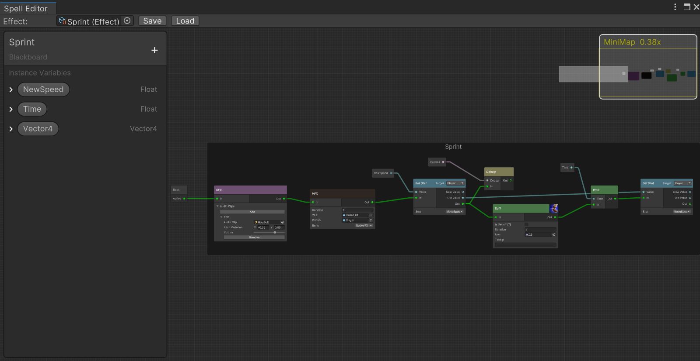
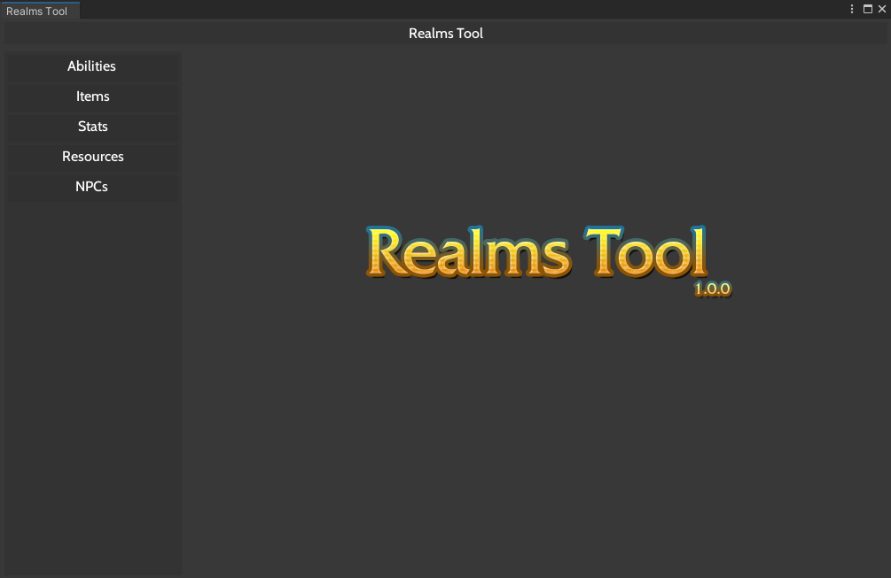
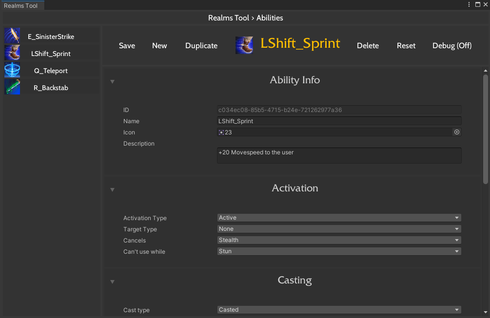

# SpellGraph

## Overview
**SpellGraph** is a node-based RPG ability creation tool made in the Unity engine. It allows developers to easily create abilities without the need for scripting and can be repurposed to suit various project needs.
<br><br>SpellGraph comes with an additional helper tool, **RealmsTool**, which allows you to visualize and manage custom data types in Unity. Both tools can be used separately and you can opt not to install RealmsTool when importing the .unitypackage.
<br><br>It was developed using the [Unity GraphView API](https://docs.unity3d.com/ScriptReference/Experimental.GraphView.GraphView.html), which may be subject to changes in the future. The current release was developed and tested for Unity version 2022.3.7f1.

## Media
<div style="text-align:center;">
  
  <div style="display:flex; justify-content:center;">
    
    
  </div>
</div>

https://github.com/fluffles64/SpellGraph/assets/61605339/7d5e01b0-ac3b-4eaa-9306-46375a23e009

*Disclaimer*: The video showcases a practical application of the SpellGraph framework. All four abilities shown in the video were fully created using nodes. The contents of the video are from a personal project and might be subject to copyright restrictions.

## Features
- **User-friendly node-based Interface**: Create complex abilities without writing a single line of code.
- **Flexible and Extensible**: Designed to be easily repurposed for different projects.
- **Sample Nodes**: A total of 26 sample nodes to get you started.
- **Key Features**:
  - Effect serialization as ScriptableObject
  - Integration with RealmsTool
  - Color coded nodes and ports
  - Styling very similar to Unity’s default environment
  - Resizable window that fits all resolutions
  - Certain ports can only be connected to specific data types
  - Node search window using reflection to find all nodes and categories
  - Strong separation of editor and runtime code
  - No runtime reflection
  - Optimized runtime algorithm to run through nodes with little boilerplate code
  - Blackboard with support for up to 8 different instance variable data types
  - Real time renaming and value changing of instance variables
  - Instance variables drag/drop
  - Runtime-changing instance variables
  - Copy/paste support for nodes, instance variables and groups via JSON
  - Accidental save protection
  - Minimap
  - Effect picker
  - Groups

## Node documentation
The nodes can be found under `Assets > SpellGraph > GraphView > Runtime > NodeLibrary`. You can utilize them as they are or use them as reference to create new nodes. Note that a significant portion of the runtime part of the nodes is commented, as these nodes are being used in a personal project, which led to external dependencies.
| **Name** | **Type** | **Description** |
|----------|----------|-----------------|
| **Special** |
| `ExtendedNode` | Node, INodeData | Base class all nodes must extend from. |
| `RootNode` | ExtendedNode | Sends an output pulse whenever the effect triggers. Always present by default and cannot be moved or deleted. |
| `NodeGroup` | Group | Organizes nodes inside. Its title can be edited. |
| `VariableNode` | ExtendedNode | Special pill-like nodes representing instance variables. They can be dragged and dropped from the Blackboard. |
| **General** |
| `DebugNode` | ActionNode | Takes a generic value as an input and prints its value in the console when it triggers. |
| `SetVarNode` | ActionNode | Dynamically selects a variable from the blackboard and assigns it a generic value determined by the input. |
| **Conditional** |
| `BoolNode` | ConditionNode | Splits the flow of execution depending on the value of a boolean input. |
| `ComparisonNode` | ActionNode | Compares two float/int values (`<`, `>`, `<=`, `>=`, `==`, `!=`) and returns a boolean. |
| **Math/Basic** |
| `AddNode` | ActionNode | Returns the sum of two input values. |
| `SubtractNode` | ActionNode | Returns the result of input A minus input B. |
| `MultiplyNode` | ActionNode | Returns the result of input A multiplied by input B. |
| `DivideNode` | ActionNode | Returns the result of input A divided by input B. |
| `PowerNode` | ActionNode | Returns the result of input A to the power of input B. |
| `SquareRootNode` | ActionNode | Returns the square root of input A. |
| **Events** |
| `OnAutoAttackNode` | EventNode | Sends out a pulse whenever the player auto-attacks. |
| **Time** |
| `BuffNode` | ActionNode | Adds a buff or debuff icon to the top right side of the player’s screen, showing its remaining duration and a tooltip. |
| `WaitNode` | StateNode | Waits for x seconds. |
| **Combat** |
| `DamageNode` | ActionNode | Deals X physical/magic/true damage to the player. Returns the resulting value. |
| `DOTNode` | ActionNode | Deals X physical/magic/true damage over time in the form of ticks, over a duration of Y seconds, at a rate of Z seconds. It can stack over similar effects. |
| `ResetAutoAttackNode` | ActionNode | Resets the auto-attack timer of the player. |
| `TeleportNode` | ActionNode | Teleports the player to a given position or to a position relative to its target. |
| **Stats** |
| `GetStatNode` | ActionNode | Returns the current value of any given stat in either the player or its target. |
| `SetStatNode` | ActionNode | Sets the current value of any given stat in either the player or its target. |
| **SFX** |
| `SFXNode` | ActionNode | Plays a random audio clip from a given list. For each audio clip, its pitch and volume can be changed. |
| **VFX** |
| `VFXNode` | ActionNode | Spawns a GameObject prefab on a child transform of a prefab for a set amount of time. For it to work, the specified bone needs to have the “VFXTransform” tag. |
| `AnimationNode` | ActionNode | Plays one shot of an animation given an animation controller. Its duration can be specified. |

## Creating a node
1. **Create a new script**
    - Go to `Assets > SpellGraph > GraphView > Runtime > NodeLibrary`.
    - Name it adequately and put it under an appropriate category.

2. **If the node is simple (only ports)**:
   - Make the newly created class extend from the "ExtendedNode" class.
   - Add the `[NodeInfo("Name", "Path", "Description")]` attribute so that the node library search window can find it.
   - To create input/output ports, use the `[InputPort("Name")]` or the `[OutputPort("Name")]` attributes, respectively.
   - The input/output port attributes will automatically color code ports based on the types of the variables below them.
   - Wrap the whole class around `#if UNITY_EDITOR #endif` clauses. 
   - Create a separate runtime node. **IMPORTANT!** Name it the same as the original class but with "Runtime" in front.
   - Make this runtime node extend from any of the runtime node types: ActionNode, StateNode, ConditionNode or EventNode.
   - Finally, override the abstract methods of these classes, and implement the logic of when the node triggers inside. Should the node relay its result to other nodes, don't forget to return that value.
   - You can use the `GetPortValue<T>(portValues[portNum])` method to retrieve input port values and make sure they are never null.<br><br>

    ```csharp
    #if UNITY_EDITOR
    [NodeInfo("Add", "Math/Basic", "Returns the sum of the two input values.")]
    public class MathBasicAddNode : ExtendedNode
    {
        [InputPort("A")]
        public float A;
    
        [InputPort("B")]
        public float B;
    
        [OutputPort("Output")]
        public float Output;
    }
    #endif
    
    public class RuntimeMathBasicAddNode : ActionNode
    {
        public override object Action(List<object> portValues, NodeData nodeData)
        {
            float a = GetPortValue<float>(portValues[0]);
            float b = GetPortValue<float>(portValues[1]);
    
            return a + b;
        }
    }
    ```

2. **If the node is complex (has elements that need to be saved, i.e. dropdown containers...)**:
   - Create both classes (editor and runtime) just like before.
   - Create a new class containing the elements you need to save, and make it extend the `NodeData` class.
   - In the constructor of the editor node, add all the visual elements you need to. You can implement them yourself, or you can utilize generic helper methods from the `ExtendedNode` class.
   - Editor nodes that contain information that needs to be saved between editor sessions all need to implement the `INodeData` interface.
   - Override the `SetValues()` and `GetNodeData()` methods from `ExtendedNode`, which inherits from `INodeData`.
   - In the `SetValues()` method, initialize the custom values (i.e. dropdowns). This method is called whenever the `Load` button is pressed in the SpellGraph toolbar.
   - In the `GetNodeData()` method, set all the values. This method is called whenever the `Save` button is pressed in the toolbar. You will need to always set the following values: `Id`, `Position`, `DataType`, `EditorType`, `RuntimeType`, `InputPortNames`, `OutputPortNames`. Then, set the custom values to the current values of the variables created in the editor node. **IMPORTANT!** Remember to set `DataType` to the custom `NodeData` type class created earlier.
   - To make organizing easier, you can put these two overridden methods inside `#region INodeData #endregion`.
   - Finally, implement the runtime node as always.<br><br>

    ```csharp
    public class StatNodeData : NodeData
    {
        public string Target;
        public string Stat;
    }
    
    #if UNITY_EDITOR
    [NodeInfo("Get Stat", "Stats", "Gets the stats of a target")]
    public class GetStatNode : ExtendedNode
    {
        private string selectedTarget = "Player";
        private string selectedStat = "Health";
        private string[] targets = Enum.GetNames(typeof(CurrentTargetType));
        private string[] stats = Enum.GetNames(typeof(StatType));
    
        [OutputPort("Value")]
        public float Value;
    
        [InputPort("In")]
        public Trigger Input;
    
        [OutputPort("Out")]
        public Trigger Output;
    
        public GetStatNode()
        {
            VisualElement targetDropdown = DropdownContainer("Target", selectedTarget, targets, newValue => selectedTarget = newValue);
            titleContainer.Add(targetDropdown);
    
            VisualElement statDropdown = DropdownContainer("Stat", selectedStat, stats, newValue => selectedStat = newValue);
            extensionContainer.Add(statDropdown);
        }
    
        #region INodeData
        public override void SetValues(NodeData data)
        {
            if (data is StatNodeData nodeData)
            {
                selectedTarget = nodeData.Target;
                selectedStat = nodeData.Stat;
            }
    
            DropdownField targetDropdown = titleContainer.Q<DropdownField>();
            targetDropdown?.SetValueWithoutNotify(selectedTarget);
    
            DropdownField statDropdown = extensionContainer.Q<DropdownField>();
            statDropdown?.SetValueWithoutNotify(selectedStat);
        }
    
        public override object GetNodeData()
        {
            return new StatNodeData
            {
                Id = Id,
                Position = GetPosition().position,
                DataType = new SerializableSystemType(typeof(StatNodeData)),
                EditorType = new SerializableSystemType(GetType()),
                RuntimeType = new SerializableSystemType(GetRuntimeType()),
                InputPortNames = GetInputPortNames(),
                OutputPortNames = GetOutputPortNames(),
                Target = selectedTarget,
                Stat = selectedStat
            };
        }
        #endregion
    }
    #endif
    
    public class RuntimeGetStatNode : ActionNode
    {
        public override object Action(List<object> portValues, NodeData nodeData)
        {
            // ...
            return null;
        }
    }
    ```

## Project Structure
The architecture of the *SpellGraph* tool is quite complex, as can be appreciated in [Project Structure SVG](Media/SpellGraph.svg?raw=true).
Many design decisions are based on the OOP paradigm, following best practices and design patterns.
## Installation
1. **Clone the repository**:

    ```bash
    git clone https://github.com/fluffles64/SpellGraph.git
    ```
    
3. **Import the Package directly into Unity**:
    - Download the latest `.unitypackage` from the [Releases](https://github.com/fluffles64/SpellGraph/releases) page.
    - Open your Unity project.
    - Go to `Assets > Import Package > Custom Package...`.
    - Select the downloaded `.unitypackage` file.

## Usage
1. **Open the SpellGraph Editor**:
    - Navigate to `Tools > SpellGraph` in the Unity menu.

2. **Create Abilities**:
    - Use the node-based interface to create and connect nodes.
    - Press space to open the node library search window.
    - Move around with the middle mouse button.
    - Copy paste with Ctrl+C/Ctrl+V
    - Drag and drop instance variables into the editor window.
    - Double click an instance variable in the Blackboard to rename it.
    - Save the newly created ability.

3. **Execute Effects**:
    - To test the abilities at runtime, you need to use the `ExecuteEffect` class. It contains a node-traversing algorithm that sequentially executes the logic found in the runtime part of the nodes.
    - Following the *Spellgraph* ecosystem, when executing an ability in your game, say, in the `Hero` class, you would need to call the `Activate()` method found in the `Ability` class, which creates a new instance of the `ExecuteEffect` class, triggering the entire `Effect`.<br><br>

**Disclaimer:** After thorough testing and examination, when profiling the application and comparing the SpellGraph visual scripting solution VS. the same abilities coded manually, the conclusion is that when executing hundreds of effects at once, the visual scripted solution is notably slower than manually coding the abilities. This is because instantiating hundreds of `ExecuteEffect` classes adds a considerable amount of work for the Garbage Collector (heap) and ends up adding ms to the frame the ability was triggered. If optimization is a priority, the traversal algorithm in the `ExecuteEffect` class should be revised, with strong graph theory and multithreading knowledge. However, this is still a very viable approach for games that don't need to trigger hundreds of abilities aren't at once, and should be a fitting solution for many single player projects.<br><br>

**Use cases**: This project has many uses apart from designing custom abilities, as shown in the video. The framework can be used for many things, from dialogue systems, to creating visual state machines for AI in your game. The possibilities are endless!.

## Contributing

1. **Fork the repository**.

2. **Create a new branch**:

    ```bash
    git checkout -b feature/YourFeature
    ```

3. **Commit your changes**:

    ```bash
    git commit -m 'Add some feature'
    ```

4. **Push to the branch**:

    ```bash
    git push origin feature/YourFeature
    ```

5. **Open a pull request**.

## License

This project is licensed under the [GNU General Public License v3.0](LICENSE.md).

## Third-Party Code

This project includes third-party code. Please see the respective files for individual licenses and attributions.
